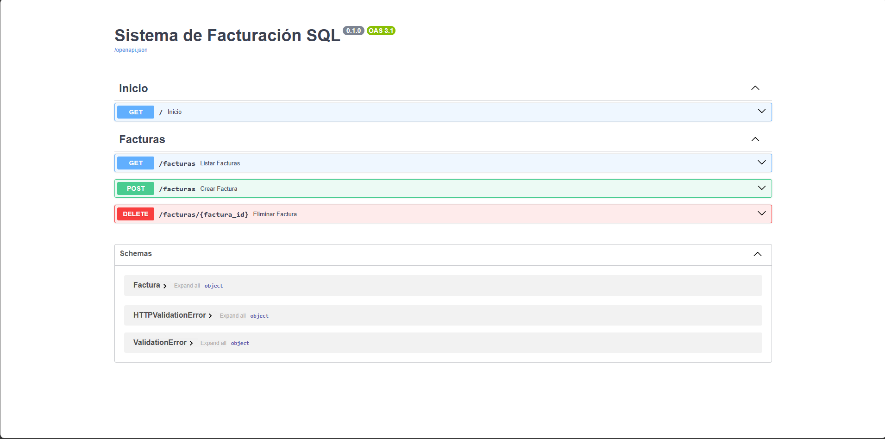

# 🧾 Sistema de Facturación SQL

Este proyecto es una API RESTful robusta diseñada para la gestión de facturación. Está construida con **Python** y **FastAPI**, utilizando **SQLite** para la persistencia de datos de forma ligera y eficiente.

## 🖼️ Vista Previa de la API
![Documentación Interactiva]
*Interfaz de Swagger UI generada automáticamente por FastAPI.*

## 🚀 Características Principales
* **Cálculo de Totales:** El sistema calcula automáticamente el IVA y el monto total a pagar antes de guardar la factura.
* **Validación de Datos:** Implementación de modelos con `Pydantic` para asegurar que los montos sean positivos y los datos del cliente sean válidos.
* **Persistencia Local:** Base de datos SQL integrada que no requiere configuración de servidores externos.
* **Documentación Técnica:** Endpoints documentados y listos para probar desde el navegador.

## 🛠️ Tecnologías Utilizadas
* **Backend:** Python 3.10+
* **Framework:** FastAPI
* **Base de Datos:** SQLite3
* **Servidor ASGI:** Uvicorn
* **Validación:** Pydantic
  
## 📂 Estructura del Proyecto
```text
.
├── assets/               # Imágenes y recursos del README
├── main.py               # Lógica principal de FastAPI y Endpoints
├── facturas.db           # Base de datos SQLite (se genera al iniciar)
└── README.md             # Documentación del proyecto

## 🔧 Instalación y Uso

1. **Clonar el repositorio:**
   ```bash
   git clone [https://github.com/tu-usuario/tu-repositorio.git](https://github.com/tu-usuario/tu-repositorio.git)
   cd tu-repositorio
